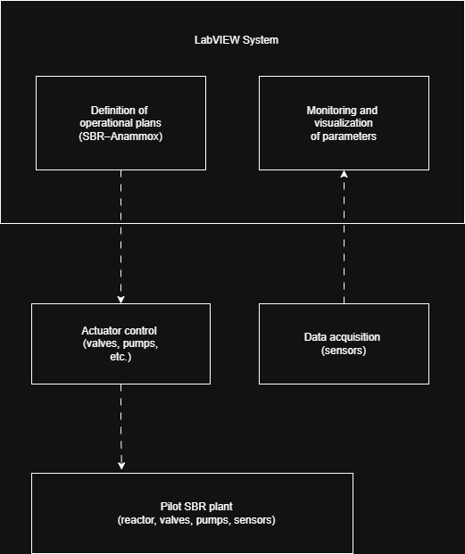

## Context

Pilot plant designed to simulate the real behavior of a **WWTP (Wastewater Treatment Plant)** for the study, validation, and optimization of **SBR–Anammox** treatment processes.

The plant was used as an experimental environment for:
- applied research
- operational strategy validation
- technical training
- decision-making prior to scaling up to full-scale plants

A system was required to connect **process, operation, and engineering**, enabling reliable and repeatable execution of complex operational plans.

---

## Problem

There was no integrated tool to:

- Define complete operational plans by phases
- Execute the SBR process in a controlled manner
- Monitor and record critical parameters in real time
- Visualize the status of all plant components
- Bridge the gap between laboratory, operation, and process engineering

Existing solutions were fragmented, limiting:
- experiment repeatability
- result analysis
- technical decision-making during pilot operation

---

## My role

Software Engineer responsible for the **end-to-end design and implementation** of the system:

- Control software development in **LabVIEW**
- System architecture design
- Industrial hardware integration
- Assembly and configuration of the industrial PC
- Integration of **National Instruments and Advantech data acquisition and relay boards**
- System commissioning on the pilot plant

---

## Designed solution

A **comprehensive management, control, and monitoring system** was developed for the pilot plant.

### System architecture overview

### SBR–Anammox process control

The system allowed defining and executing operational plans composed of:

- **Fill**
- **React (anoxic)**
- **Settle**
- **Decant**
- **Idle**

Each phase managed the state of the following components in a controlled manner:
- valves
- pumps
- auxiliary process components

---

### Monitoring of critical parameters

The system monitored and recorded in real time:

- **NH₄⁺ / NO₂⁻ / NO₃⁻**
- **ORP (oxidation–reduction potential)**
- **pH**
- **Dissolved Oxygen (DO < 0.5 mg/L)**
- **Temperature**
- **HRT (Hydraulic Retention Time)**

These parameters were essential to:
- induce and stabilize the Anammox process
- analyze reactor behavior
- adjust operational strategies during pilot operation

---

## System users

The system was used daily by:

- Interns and students
- Process engineers specialized in SBR–Anammox
- Chemical and environmental engineering staff

It enabled them to:

- Define SBR operational strategies
- Design multi-stage operational plans
- Plan and execute pilot plant experiments
- Analyze results and propose optimizations
- Validate technologies prior to full-scale deployment
- Coordinate operation, sampling, and analysis

---

## Outcome

- Stable and reliable operation in an industrial environment
- Controlled and repeatable execution of complex experiments
- Significant improvement in data traceability and analysis
- Effective integration between laboratory, operation, and engineering
- Solid technical foundation for process validation and decision-making

This work was part of my **Final Degree Project in Computer Engineering**.

---

## Key learnings

- Industrial software must understand the process, not just control it
- Reliability is a requirement, not an improvement
- A good system connects people, data, and decisions
- Software engineering creates real value when deeply integrated with the problem domain