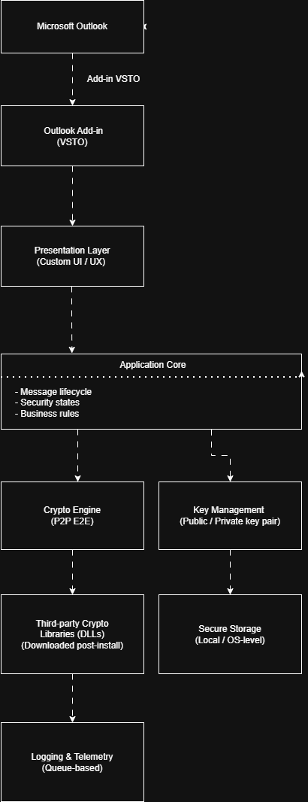

## Context

Project developed for a corporate security platform integrated into Microsoft Outlook, focused on protecting email communications through end-to-end encryption.

An Outlook VSTO add-in designed to provide **peer-to-peer encrypted email communication**, preventing *Man-in-the-Middle* attacks and identity spoofing.

The product operated under strong **security, cryptography, and compliance requirements**, targeting environments where **confidentiality and message integrity** were critical.

When I joined the company, the project was almost entirely dependent on a single developer, with most of the knowledge highly concentrated.

---

## Initial situation

At the time I took ownership of the project, several issues were evident:

- Poor and unfriendly user interface
- Multiple functional and stability bugs
- Lack of proper technical documentation
- Architecture difficult to understand for newcomers
- High risk due to single-person knowledge dependency
- Unstructured branching and deployment processes

I had **only one week of handover** before fully assuming responsibility for the add-in.

---

## My role

I acted as **principal engineer and technical lead** for the project:

- Ownership of the client-side architecture
- Critical technical decision-making
- Close collaboration with CTO, CPO, PO, UX/UI and QA
- Technical leadership in a security-critical product
- Responsibility for development, review, and release processes

For a significant period, I was **the sole active developer**.

---

## Product-focused approach

The development of the add-in took place in a clearly product-oriented environment, where technical decisions were aligned with business goals, user experience, and regulatory requirements.

I worked closely with product, UX/UI, and technical leadership roles to balance **security, usability, and operational viability**, avoiding solutions that were technically correct but difficult to maintain or impractical from a product perspective.

---

## Initial approach

Before introducing new features, the focus was on stability and understanding:

- Deep analysis of the existing architecture
- Comprehensive system documentation
- Risk reduction at both technical and organizational levels
- Preparing the codebase for future team growth

This included:
- Reverse-engineering key flows and dependencies
- Creating multiple **UML diagrams** to explain the system
- Documenting critical processes
- Ensuring knowledge was not locked to a single person

---

## System architecture

---

## UI redesign

One of the most visible improvements was a **complete UI redesign**:

- A new interface built from scratch
- UX designed in collaboration with UI/UX specialists
- Clean and maintainable UI architecture
- Significant improvement in usability and clarity

I defined and implemented the **technical foundation of the UI**, ensuring long-term maintainability.

---

## Security and encryption

The add-in was built around strong security guarantees:

- End-to-end encrypted email communication
- Protection against identity impersonation
- Message integrity verification

Key aspects:
- Each user owned a **public-private key pair**
- Messages were encrypted using the recipient’s public key
- Decryption was performed using the recipient’s private key
- The add-in clearly displayed trust and security states to users

Security was not an add-on—it was **the core of the product**.

The design assumed **no trust in the communication channel or intermediaries**, enforcing end-to-end encryption and explicit identity and message-state validation, aligned with modern zero trust security approaches.

The design was driven by classic security principles: **confidentiality, integrity, and identity assurance**, without compromising user experience or Outlook stability.

---

## Key technical decisions

As technical owner, I made several critical decisions:

- Definition of the **branching and release strategy**
- Strict code review and quality control
- Centralized merge and deployment responsibility
- Design and implementation of the **digital signing process**
- Architecture to decouple **third-party proprietary DLLs**

Due to licensing constraints:
- Certain DLLs could not be shipped with the installer
- A secure download mechanism was implemented
- DLLs were retrieved from an authorized server post-installation

---

## Logging and performance

I designed and implemented a **queue-based logging architecture** from scratch:

- Minimal performance impact
- No blocking of critical execution paths
- Improved traceability and diagnostics

This provided better observability without degrading user experience.

---

## Outcome

- Stable and maintainable product
- Modern and user-friendly UI
- Well-documented architecture
- Reduced organizational risk
- Solid foundation for team growth
- Reliable development and deployment processes

The add-in evolved from a fragile, single-person-dependent system into a **robust, documented, and scalable product**.

---

## Key takeaways

- Security requires design, discipline, and consistency
- Documentation is a risk-reduction tool
- Technical leadership is about ownership, not visibility
- A secure product ultimately builds **trust**