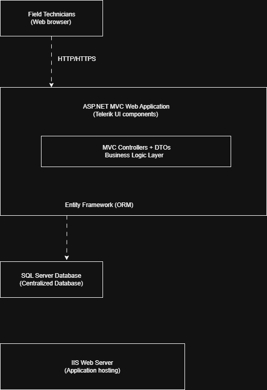

## Context

A production industrial web application used by field technicians to register regulated inspections in compliance-driven environments.

The system was a central part of the operational process:
- full inspection recording
- traceability of installations and equipment
- issuance of official certifications when regulatory requirements were met

Availability and reliability were critical for both daily operations and the business.

---

## Initial Situation

When I joined the project, the system was in a fragile and unstable state:

- Frequent and seemingly random production outages
- Recurrent application restarts causing service downtime
- Field technicians forced to fall back to paper-based inspections
- Widespread user frustration
- Direct financial impact during each outage
- Fragile deployments with a high risk of breaking existing functionality
- Lack of technical documentation and clearly defined processes
- Critical dependency on external knowledge no longer available internally

Even small changes caused unexpected side effects.

### Initial Architecture

---

## My Role

I assumed the role of primary technical owner of the system:

- Making critical technical decisions
- Taking responsibility for stability, deployments, and service continuity
- Acting as the technical reference in a high-pressure business environment

---

## Initial Approach (Before Touching the Code)

Before introducing any changes, the priority was to understand and bring order to the system:

- In-depth analysis of the system’s real state
- Identification of critical dependencies and main operational flows
- Documentation of architecture, processes, and deployment practices that were missing or unclear
- Strict prioritization driven by business impact

One decision guided all actions:  
**stability had priority over any new functionality.**

---

## Key Decisions

A conscious and sustained decision was made:

- No new features until the system was stable

Despite pressure to continue delivering new functionality, the focus remained on:
- reducing incidents
- restoring trust in the system
- avoiding further complexity on an unstable foundation

---

## Technical Actions

- Definition and documentation of a clear, reproducible deployment process
- Introduction of safer deployment strategies
- Code reviews focused on preventing regressions
- Improvements to delivery flows to eliminate recurring failures
- Gradual reduction of external dependency through knowledge extraction and controlled communication
- Analysis and optimization of the data layer, identifying critical queries and adjusting schema and indexes to reduce blocking and unstable behavior in production

---

## Outcome

- Elimination of recurring production outages
- Stable and predictable deployments
- Restoration of normal operations for field technicians
- Reduced risk when introducing changes
- Recovered business confidence in the system

A solid technical foundation was established, enabling the product to evolve again with significantly lower risk.

---

## Key Learnings

- Stability is not an improvement — it is a prerequisite
- Often, the best technical decision is **not to do more**, but to do less and do it better
- Stabilizing a system can be as valuable as building a new one
- Mature architecture prioritizes continuity over cleverness

This type of work is rarely visible, but it often makes the difference  
between a system that merely survives and one the business can truly rely on.