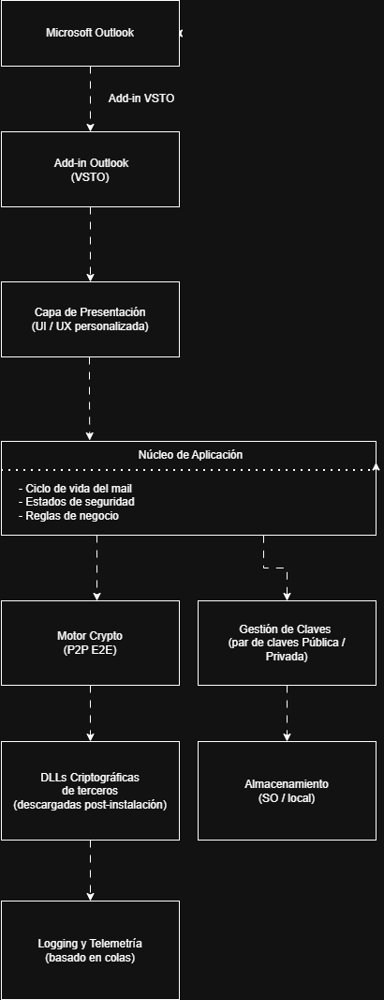

## Contexto

Proyecto desarrollado para una plataforma de seguridad corporativa integrada en Microsoft Outlook, orientada a la protección de comunicaciones mediante cifrado extremo a extremo.

Add-in VSTO para Microsoft Outlook diseñado para proporcionar **cifrado peer-to-peer de correos electrónicos**, previniendo ataques de intermediario (*Man-in-the-Middle*) y suplantaciones de identidad.

El producto tenía un fuerte componente de **seguridad, criptografía y cumplimiento normativo**, y estaba destinado a entornos donde la **confidencialidad y la integridad del mensaje** eran críticas.

Cuando me incorporé al proyecto, el desarrollo recaía prácticamente en una única persona y el conocimiento estaba altamente concentrado.

---

## Situación inicial

Al asumir el proyecto, el estado del sistema presentaba varios problemas relevantes:

- Interfaz de usuario poco usable y nada alineada con estándares UX
- Múltiples bugs funcionales y de estabilidad
- Escasa documentación técnica
- Arquitectura difícil de entender para nuevas incorporaciones
- Alto riesgo de dependencia de conocimiento individual
- Proceso de despliegue y versionado poco estructurado

Además, solo conté con **una semana de traspaso** antes de asumir completamente la responsabilidad técnica del add-in.

---

## Mi rol

Asumí el rol de **principal engineer y referente técnico del proyecto**:

- Responsable de la arquitectura del add-in desde el lado cliente
- Toma de decisiones técnicas críticas
- Coordinación técnica con CTO, CPO, PO, UX/UI y QA
- Liderazgo técnico en un entorno con fuertes requisitos de seguridad
- Responsable del flujo de desarrollo, revisión y despliegue

Durante un periodo fui **el único desarrollador activo** del producto.

---

## Enfoque de producto

El desarrollo del add-in se realizó en un entorno claramente orientado a producto, donde las decisiones técnicas estaban alineadas con objetivos de negocio, experiencia de usuario y cumplimiento normativo.

Trabajé de forma continua con perfiles de producto, UX/UI y dirección técnica para equilibrar **seguridad, usabilidad y viabilidad operativa**, evitando soluciones técnicamente correctas pero difíciles de mantener o inviables a nivel de producto.

---

## Enfoque inicial

Antes de añadir nuevas funcionalidades, el foco fue claro:

- Comprender en profundidad la arquitectura existente
- Documentar el funcionamiento real del sistema
- Reducir el riesgo técnico y organizativo
- Sentar bases sólidas para la escalabilidad del equipo

Para ello:

- Analicé el código existente y su interacción con Outlook y VSTO
- Elaboré múltiples **diagramas UML** (componentes, flujos y dependencias)
- Documenté procesos clave para evitar concentración de conocimiento
- Preparé el sistema para futuras incorporaciones al equipo

---

## Arquitectura general del sistema

---

## Rediseño de la interfaz

Uno de los cambios más visibles fue el **rediseño completo de la interfaz** del add-in:

- Se creó una UI nueva desde cero
- Diseño trabajado conjuntamente con especialistas UX/UI
- Arquitectura desacoplada para facilitar mantenimiento y evolución
- Mejora radical de la experiencia de usuario

Mi responsabilidad fue **definir la arquitectura base de la UI e implementarla**, asegurando coherencia técnica y estabilidad.

---

## Seguridad y cifrado

El add-in tenía como objetivo garantizar:

- Cifrado extremo a extremo de los mensajes
- Prevención de suplantación de identidad
- Integridad del contenido del correo

Para ello:

- Cada usuario disponía de un **par de claves pública-privada**
- Los mensajes se cifraban con la clave pública del destinatario
- El destinatario descifraba el contenido con su clave privada
- El sistema mostraba estados claros de confianza del mensaje al usuario

La seguridad no era una característica adicional, sino el **núcleo del producto**.

El diseño partía del principio de **no confiar en el canal ni en los intermediarios**, aplicando cifrado extremo a extremo y validación explícita de identidad y estado del mensaje, en línea con enfoques modernos de seguridad tipo zero trust.

El diseño priorizaba principios clásicos de seguridad: **confidencialidad, integridad y control de identidad**, sin comprometer la experiencia de usuario ni la estabilidad del cliente Outlook.

---

## Decisiones técnicas clave

Algunas decisiones relevantes que tomé como responsable técnico:

- Definición del **modelo de ramificación** y flujo de desarrollo
- Proceso estricto de **code review y control de calidad**
- Gestión centralizada de merges y releases
- Diseño del proceso de **firma digital del add-in**
- Arquitectura para desacoplar **DLLs propietarias de terceros**

Por motivos legales, ciertas DLLs no podían distribuirse junto al instalador:
- Se diseñó un mecanismo seguro para descargarlas desde un servidor autorizado
- Se integraban dinámicamente tras la instalación del add-in

---

## Logging y rendimiento

Implementé desde cero una **nueva arquitectura de logging basada en colas**, orientada a:

- Minimizar impacto en rendimiento
- Evitar bloqueos en operaciones críticas
- Facilitar diagnóstico y trazabilidad

Este sistema permitió mejorar la observabilidad sin comprometer la experiencia del usuario.

---

## Resultado

- Producto estabilizado y mantenible
- Interfaz moderna y usable
- Arquitectura documentada y comprensible
- Reducción del riesgo organizativo
- Base sólida para escalar el equipo
- Procesos de desarrollo y despliegue fiables

El add-in pasó de ser un sistema frágil y dependiente de una sola persona a un producto **robusto, documentado y sostenible**.

---

## Aprendizajes

- La seguridad requiere tanto diseño como disciplina
- Documentar es una forma de reducir riesgo, no una pérdida de tiempo
- El liderazgo técnico es asumir responsabilidad, no protagonismo
- Un buen producto no solo cifra datos: **genera confianza**