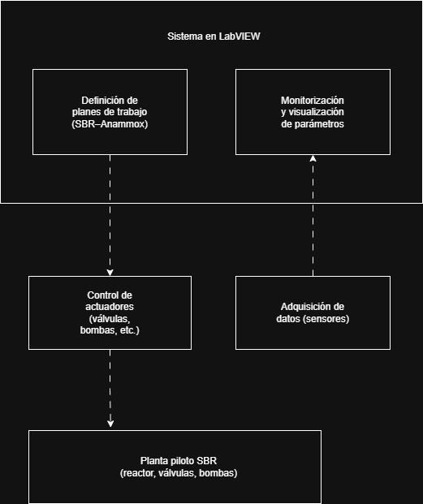

## Contexto

Planta piloto destinada a simular el comportamiento real de una **EDAR (Estación Depuradora de Aguas Residuales)** para el estudio, validación y optimización de procesos de saneamiento basados en **SBR–Anammox**.

La planta se utilizaba como entorno experimental para:
- investigación aplicada
- validación de estrategias de operación
- formación técnica
- toma de decisiones previa al escalado a planta real

Era necesario un sistema que conectara **proceso, operación e ingeniería**, permitiendo definir, ejecutar y analizar planes de trabajo complejos de forma fiable y repetible.

---

## Problema

No existía una herramienta que permitiera:

- Definir planes de operación completos por fases
- Ejecutar de forma controlada el proceso SBR
- Monitorizar y registrar parámetros críticos en tiempo real
- Visualizar el estado de todos los componentes de la planta
- Servir de puente entre laboratorio, operación e ingeniería de procesos

La operación dependía de soluciones parciales y poco integradas, lo que dificultaba:
- la repetibilidad de ensayos
- el análisis de resultados
- la toma de decisiones técnicas durante el piloto

---

## Mi rol

Ingeniero informático responsable del **diseño e implementación completa del sistema**, desde cero:

- Desarrollo del software de control en **LabVIEW**
- Diseño de la arquitectura del sistema
- Integración con hardware industrial
- Montaje y configuración del ordenador industrial
- Integración de placas de **adquisición de datos y relés National Instruments y Advantech**
- Puesta en marcha del sistema en planta piloto

---

## Solución diseñada

Se desarrolló un **sistema integral de gestión, control y monitorización** de la planta piloto.

### Arquitectura general del sistema

### Control del proceso SBR–Anammox

El sistema permitía definir y ejecutar planes de trabajo compuestos por las fases:

- **Llenado**
- **Reacción (anóxica)**
- **Sedimentación**
- **Decantación**
- **Reposo**

Cada fase gestionaba de forma controlada el estado de:
- válvulas
- bombas
- elementos auxiliares del proceso

---

### Monitorización de parámetros críticos

El sistema controlaba y registraba en tiempo real:

- **NH₄⁺ / NO₂⁻ / NO₃⁻**
- **ORP (potencial redox)**
- **pH**
- **Oxígeno disuelto (DO < 0,5 mg/L)**
- **Temperatura**
- **TRH (Tiempo de Retención Hidráulica)**

Estos parámetros eran clave para:
- inducir y estabilizar el proceso Anammox
- analizar el comportamiento del reactor
- ajustar estrategias operativas durante el piloto

---

## Usuarios del sistema

El sistema era utilizado diariamente por:

- Becarios y estudiantes
- Ingenieros/as de procesos especialistas en SBR–Anammox
- Personal del departamento de ingeniería química y medioambiental

Permitía:

- Definir estrategias de operación SBR
- Diseñar planes de trabajo por etapas
- Planificar y ejecutar ensayos en planta piloto
- Analizar resultados y proponer ajustes
- Validar tecnologías antes de su escalado a EDAR real
- Coordinar operación, muestreo y análisis

---

## Resultado

- Sistema operativo y estable en entorno industrial
- Ejecución controlada y repetible de ensayos complejos
- Mejora significativa en la trazabilidad de datos y resultados
- Integración efectiva entre laboratorio, operación e ingeniería
- Base técnica sólida para la toma de decisiones y validación de procesos

Este trabajo formó parte de mi **Proyecto Final de Carrera como Ingeniero Superior en Informática**.

---

## Aprendizajes

- El software industrial debe entender el proceso, no solo controlarlo
- La fiabilidad es un requisito, no una mejora
- Un buen sistema conecta personas, datos y decisiones
- La ingeniería informática aporta valor real cuando se integra con el dominio del problema